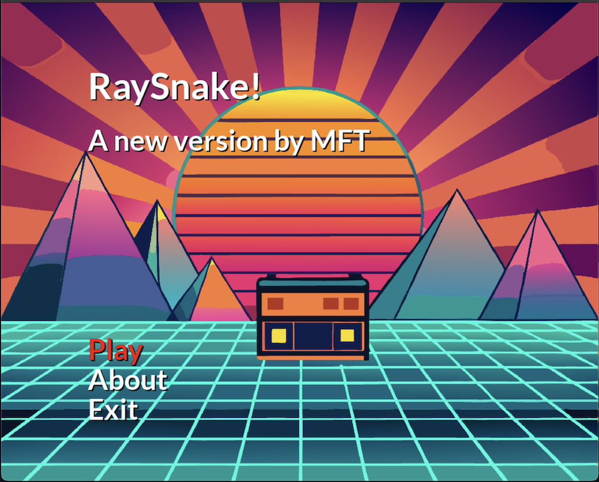
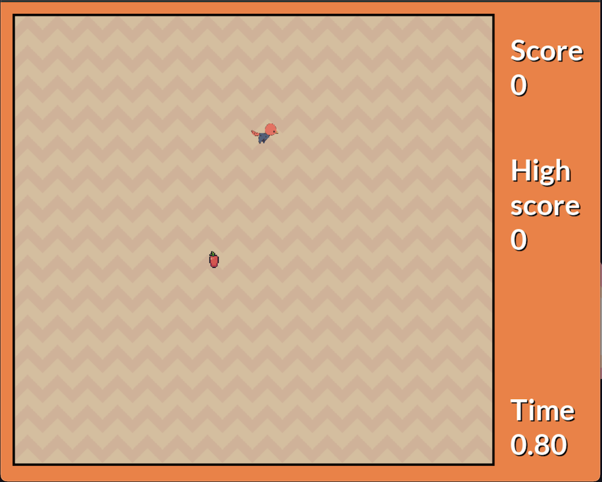

# RaySnakeSDL

## About the Project

**RaySnakeSDL** is a classic Snake game built using **C++20** and the **SDL2** library. The project showcases a simple yet enjoyable gaming experience while highlighting SDL2's capabilities in game development.

Main screen    |  Game
:-------------------------:|:-------------------------:
  |  


### Gameplay

- Navigate the snake using the **arrow keys** or **WASD**.
- Eat the food to make your snake grow.
- Avoid running into walls or colliding with yourself to keep playing.
- Increase the challenge as the snake moves faster with increasing difficulty.

---

## Getting Started

Follow these steps to build and run the project on your machine.

### Prerequisites

Ensure you have the following libraries installed on your system:

- **SDL2**
- **SDL2_image**
- **SDL2_ttf**
- **SDL2_mixer**

On Linux, you can install these dependencies using your package manager. For example, on Arch:

```bash
sudo pacman -S sdl2 sdl2_mixer sdl2_image sdl2_ttf
```
or on Mac:

```bash
brew install sdl2 sdl2_mixer sdl2_image sdl2_ttf
```
### Build Instructions

1. Clone the repository:

    ```bash
    git clone https://github.com/MatthewFTang/RaySnakeSDL.git
    cd RaySnakeSDL
    ```

2. Create a build directory:

    ```bash
    mkdir build
    cd build
    ```

3. Build the project using CMake and `make` and run:

    ```bash
    cmake ..
    make
    ./RaySnakeSDL
    ```

---

## Controls

- **Arrow Keys or WASD**: Control the snake’s direction.
- **Objective**: Grow your snake by eating the food while avoiding collisions.

---

## Features

- Classic snake game mechanics.
- Difficulty scaling as the snake grows.
- Smooth gameplay using SDL2.
- Cross-platform support.

---

## Contributing

Contributions are welcome! If you have suggestions for improving the game or adding new features:

1. Fork the repository.
2. Create a new branch for your feature: `git checkout -b feature/NewFeature`.
3. Commit your changes: `git commit -m 'Add new feature'`.
4. Push to the branch: `git push origin feature/NewFeature`.
5. Open a pull request.

---


## Acknowledgments

- Thanks to the SDL2 library for providing an excellent framework for game development.
- Inspired by classic Snake games.

Enjoy the game!
